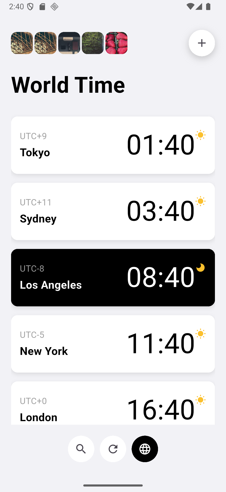

# 🌐 Modern World Time Tracker

[](https://flutter.dev/)
[](https://dart.dev/)

An app to track multiple time zones with an interactive world map.

🔹 Features
- Time API usage / use provider
- Multiple Time Track
- Add new time zone


# 📂Project Structure

```bash
assets/                  # Images and resources
docs/                    # Screenshots for readme
lib/
├── main.dart            # main
├── config/              # General settings and constants
├── models/              # Data models and repositories
├── providers/           # State providers
├── screens/             # Screens and widgets
└── widgets

```

## 💻 Screenshots
 
<!-- 
  
-->

## 🎨 Design Inspired

This project is


